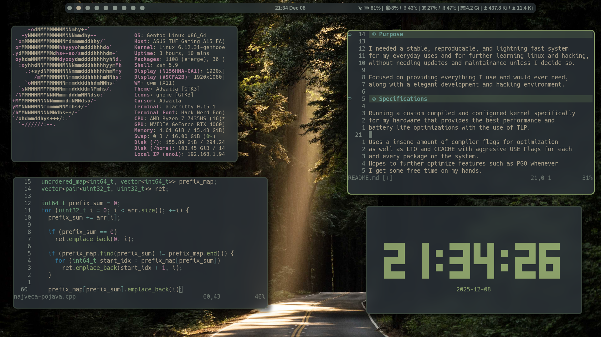

# Gentoo Main System

### Everforest Theme

## Purpose

I needed a *stable, reproducable, and lightning fast system*
for my everyday uses and for further learning linux and hacking, 
without needing updates and maintainance unless I decide so.

Focused on providing everything I use and would ever need,
along with a elegant development and hacking environment.

## Specifications

Running a custom compiled and configured kernel specifically
for my hardware that provides the best performance and
battery life optimizations with the use of TLP.

Uses a insane amount of compiler flags for optimization
as well as LTO and CCACHE with aggresive USE Flags for each
and *every package on the system*.
Hopes to further optimize features such as PGO whenever
I get some free time on my hands.

Comes with plenty of tools for hacking and programming,
as well as a fully suited IDE and general application.
A custom patched GUI experience with dwm and slstatus,
mainly adding cosmetic and workflow upgrades 
as well as nvidia support.

## Conclusion

I've been absolutely satisfied with this system and the
distribution, it has helped me to learn new thigns in
tremendous ways! Would recommend to everyone with
some experience in Linux.
